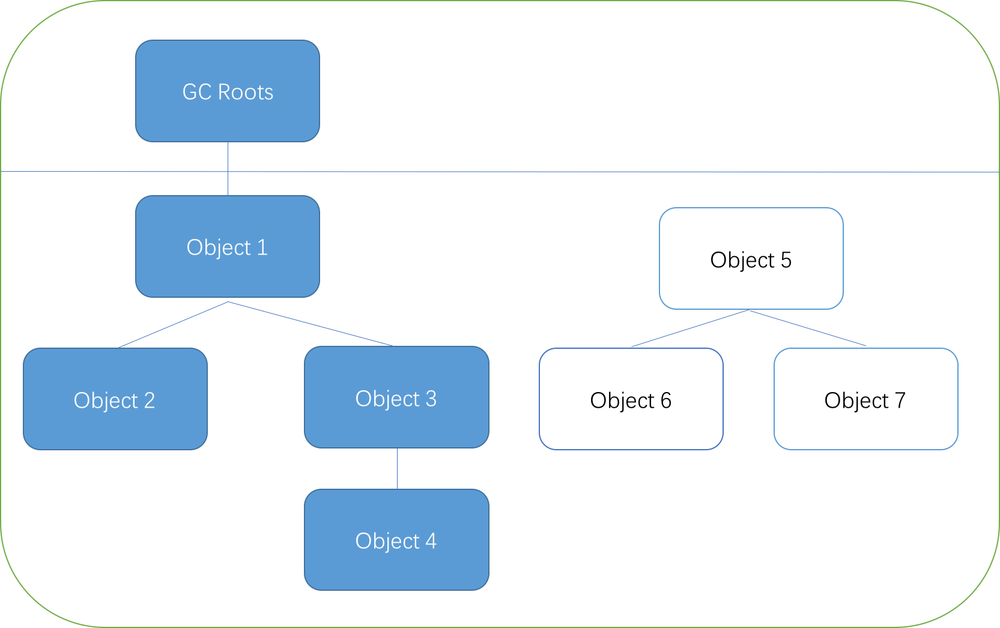
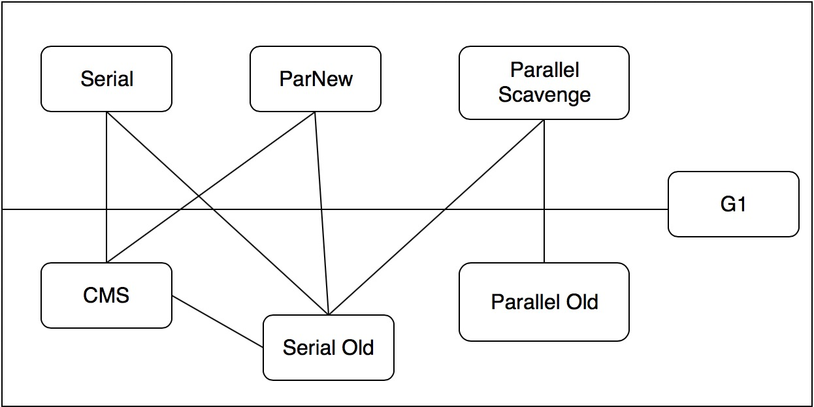
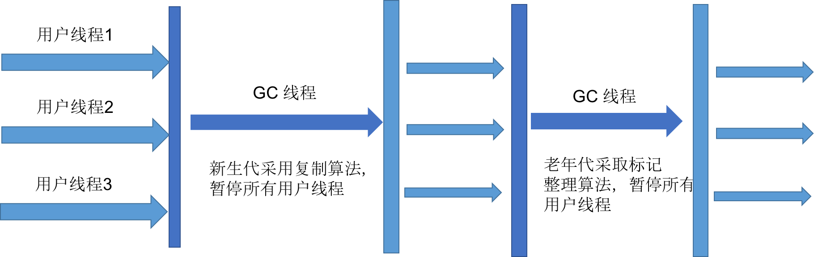
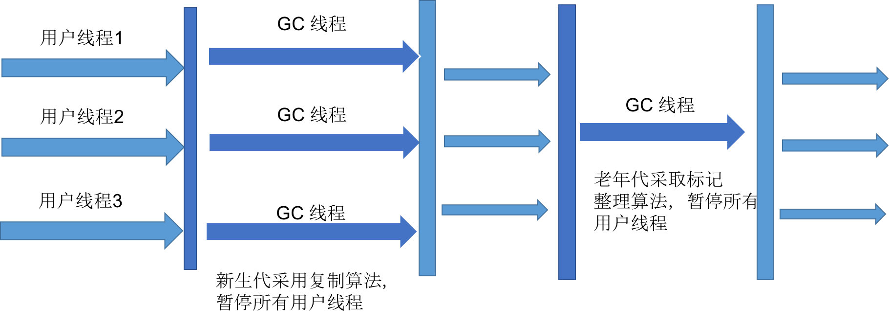
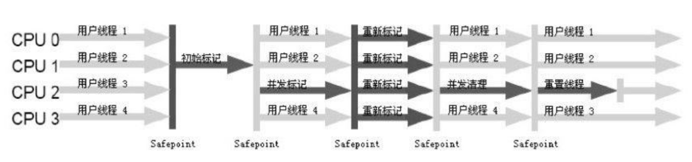

# 		垃圾回收器和内存分配
## 概述
+ 哪些内存需要回收
+ 什么时候回收
+ 如何回收

## 垃圾回收判定算法
### 引用计数法
       对象中添加引用计数器，被引用时计数器 +1； 引用失效时计数器 -1。计数器为0的对象，表示不再使用，可以被回收。
缺点：对象之间循环调用，引用计数器无法 GC 此类对象；目前收集器也没有再使用该方法

### 可达性分析
        通过一系列称为 “GC Roots” 的对象作为起始点，从这些节点向下搜索，搜索走过的路径称为引用链。当一个对象到 GC Roots 没有任何引用链相连(对象不可达)，则证明此对象是不可用的。

## 垃圾收集算法
### 标记清除
       最基础的收集算法：标记清除（Mark-Sweep），分为标记和清除两个阶段。缺点是标记和清除的效率都不高，另外容易产生大量的不连续内存碎片，导致给大对象分配内存时无法找到足够的连续内存而提前出发 GC

### 复制算法
        为解决效率问题，将内存按容量分成了大小相等的两块，每次只使用一块；当一块用完时，将存活的对象复制到另外一块，然后回收掉已经使用的空间。

* 优点：实现简单，运行高效
* 缺点：将内存缩小为原来一半，成本太大

年轻代收集：分为三块，Eden区、两块 Survivor区，比例 8：1：1

### 标记整理
        复制收集算法在对象存活率很高的时候要进行较多的复制操作，效率变低。针对老年代存活率高的特点，提出了标记整理算法。也是首先进行标记需要回收的对象，然后让所有存活对象都移动到一端，最后清除掉存活边界以外的内存。

### 分代回收
分为年轻代和老年代，针对不同代使用不同的回收算法。              
> 年轻代：复制算法  
> 老年代：标记整理  

## 垃圾回收器
       垃圾回收器是垃圾回收算法的具体实现，Java 虚拟机规范对于如何实现垃圾回收算法没有具体要求，也导致不同的厂商生产实现出不同的垃圾回收器，HotSpot虚拟机主要实现的垃圾回收器如下图：
    
7种不同分代的收集器，存在连线表示两者可以搭配使用。虚拟机所处的区域（上为Young generation，下为 Tenured generation），表示他们是新生代收集器和老年代收集器。不同的垃圾回收器有各自的优缺点，分别适用于不同的场景，**CMS**和 **G1** 这两种需要重点了解。
***
**垃圾回收器的优化：在缩短用户线程停顿时间的同时，能够最大化 GC 的吞吐量。**
***
### Serial 收集器
 最基本、发展历史最悠久的收集器，是一个单线程的收集器.    

+ 优点：简单高效，没有线程间的交互开销，能够专心做垃圾收集最大化单线程收集效率  
+ 缺点：在垃圾回收阶段，需要暂停其他所有的工作线程，直到 GC 工作完成。“Stop The World”：在用户不可见的情况下把用户正常工作的线程全部暂停，这是比较难以接受的。   
Serial/Serial Old 收集器运行过程：
    

### ParNew 收集器
Serial 收集器的多线程版本

### Parallel Scavenge 收集器：吞吐量优先
Parallel Scavenge 收集器是一个新生代收集器，也是使用复制算法的收集器，又是并行的多线程收集器。  
特点：尽可能达到一个可控制的吞吐量，吞吐量=运行用户代码时间/(运行用户代码时间 + GC 时间)  
两个用于精确控制吞吐量的参数：  

* MaxGCPauseMillis：控制最大垃圾收集停顿时间
* GCTimeRatio：设置吞吐量大小

### Serial Old 收集器
Serial Old 是 Serial 收集器的老年代版本，同样是一个单线程，使用标记-整理算法。主要意义是在给 Client 模式下的虚拟机使用。如果在 Server模式下，有两个主要用途：一种是在 JDK1.5及之前的版本中与 Parallel Scavenge 搭配使用，另外一种就是作为 CMS 收集器的后备方案。

### Parallel Old 收集器
Parallel Old 是 Parallel Scavenge 收集器的老年代版本，使用多线程和标记整理算法。（老年代也是多线程 GC）

### CMS 收集器
CMS (Concurrent Mark Sweep)收集器是一种以获取最短回收停顿时间为目标的收集器，目前为主流的 GC，是基于标记-清除算法实现，分为四个过程：    

+ 初始标记：仅仅标记下 GC Roots 能直接关联到的对象，速度很快（单线程，stop the world）
+ 并发标记：进行 GC Roots Tracing
+ 重新标记：修正并发标记期间因用户程序继续运行导致标记产生变动的那部分对象记录（多线程，stop the world）
+ 并发清除：并发进行 GC 操作 

***
并发收集、低停顿，GC 操作能够和用户线程一起并发执行
***

也并非完美，存在3个缺点：

+ 无法处理浮动垃圾（并发清理阶段用户线程运行，产生的新的垃圾），出现在标记之后 CMS无法清理，只能等待下一次 GC。 还需要预留一部分空间提供并发收集时的程序使用，因此 **CMS 当老年代使用 68% 就会被激活**，也可以通过-XX:CMSInitiatingOccupancyFraction 参数进行调整
+ 基于 “标记-清除” 算法，容易产生内存碎片。可以通过设置 -XX:UseCMSCompactAtFullCollection，其作用为进行 FullGC 时开启内存碎片的合并整理（内存合并整理无法并发，耗时较长）
+ CPU 资源非常敏感

### G1 收集器
一款面向服务端应用的垃圾回收器，其特点有：  
1. 并行与并发：使用多个CPU缩短 Stop the World 停顿时间  
2. 分代收集：与其他收集器一样，对不同代采用不同回收算法  
3. 空间整合：与CMS不同，使用的是“标记-整理”算法，无内存碎片  
4. 可预测的停顿：相对于 CMS 最大的优势，通过在保留新生代和老年代概念基础上，将Java堆划分为多个大小相等的独立区域，建立可预测的停顿时间模型

运行的步骤：  
1. 初始标记  
2. 并发标记  
3. 最终标记  
4. 筛选回收

## 内存分配策略
### 对象优先在 Eden 分配
+ 新生代GC(Minor GC): 新生代的垃圾回收，非常频繁，速度比较快
+ 老年代(Full GC): 老年代的 GC，出现 Full GC 一般会伴随至少一次 Minor GC，速度慢 10倍

### 大对象直接进入老年代
-XX：PretenureSizeThreshold，设置大对象直接在老年代分配，避免重复复制

### 长期存活的对象将进入老年代
-XX：MaxTenuringThreshold，设置对象晋升老年代的年龄阈值

### 动态对象年龄判定
虚拟机并不是一定要求对象的年龄到达 MaxTenuringThreshold 才能晋升老年代，如果 **Survivor 空间中相同年龄所有对象大小总和大于Survivor 空间的一半**，大于或等于该年龄的对象都可以进入老年代

### 空间分配担保
+ 发生 Minor GC 之前，老年代最大可用连续空间大于新生代所有对象总空间，可以确保 Minor GC 是安全的。
+ 上述条件不成立时，通过设置 HandlePromotionFailure（是否允许冒险）检查老年代最大可用连续空间是否大于以往晋升到老年代对象的平均值，大于则进行一次 Minor GC；如果小于或者 HandlePromotionFailure 为false，则进行一个 Full GC

