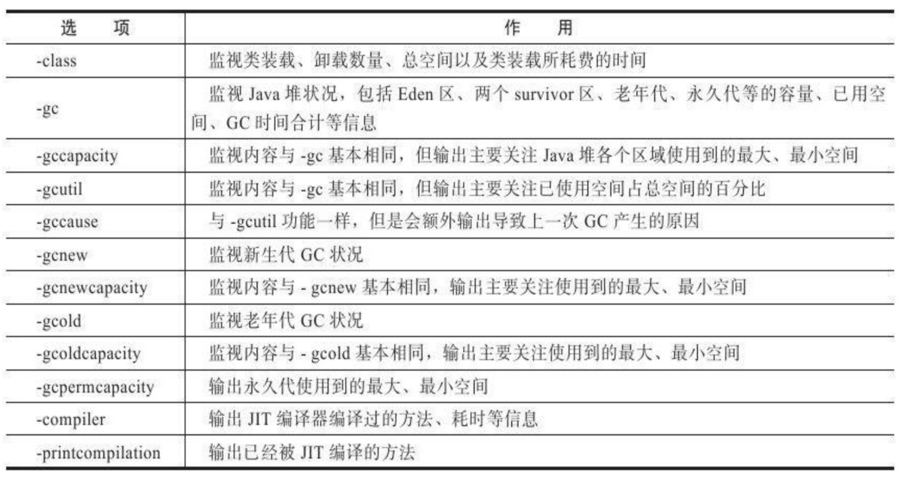
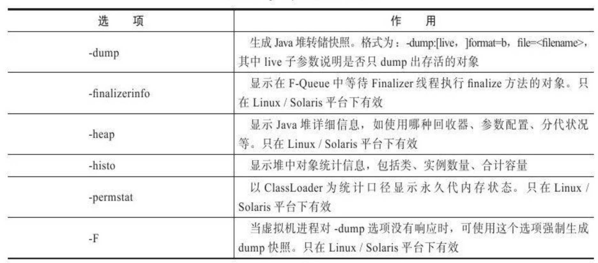

#         虚拟机性能监控与故障处理工具
## JDK 命令行工具
        bin 目录下的其他命令行工具（Linux 版本的JDK，这些工具很多都是直接用 Shell 脚本写成，可以用 vim 打开）。采用 Java 代码来实现监控工具的意义：应用部署到生产环境后，无论是直接接触物理服务器还是远程 Telnet 到服务器上都可能会受到限制。借助 tools.jar 类库的接口，可以直接在应用程序中实现功能强大的监控分析功能。
### jps：虚拟机进程状况工具
         功能和 Unix中的 ps 命令类似：可以列出正在运行的虚拟机进程，并显示虚拟机执行主类名称（Main Class）以及这些进程的本地虚拟机唯一ID（LVMID，即 pid），参数包含：  
1. -q：只输出 LVMID，省略主类的名称   
2. -m：输出虚拟机进程启动时传递给主类 main() 函数的参数   
3. -l：输出主类的全名（如果进程执行的是 jar 包，则输出 jar 路径）   
4. -v：输出虚拟机进程启动时 JVM 参数

### jstat：虚拟机统计信息监视工具
         可以显示本地或远程虚拟机进程中类装载、内存、垃圾收集、JIT编译等运行数据（无 GUI 图形界面显示上述数据时使用）。**使用远程虚拟机时：需要开启 RMI 服务**  
样例：jstat -gc 2766 250 20(每 250 毫秒查询一次进程号为2766的垃圾回收状况，总共查询20次)

### jinfo: Java 配置信息工具
         jinfo 作用是实时查看和调整虚拟机各项参数。使用 jps的 -v参数可以查看虚拟机启动时显示指定的参数列表，但如果想知道未被显示指定的参数的系统默认值，可以使用jinfo -flag下旬，也可以使用 -sysprops 把虚拟机进程的 System.getProperties()的内容打印出来。

### jmap: Java 内存映像工具
         jmap(Memory Map for Java) 命令用于生成堆转储快照。不仅能够获取 dump 文件，还可以查询 finalize执行队列、Java堆和永久代的信息：空间使用率、当前使用的收集器等。
可调参数：

### jhat: 虚拟机堆转储快照分析工具
        jhat 命令与jmap搭配啥用，来分析jmap生成的堆转储快照。jhat内置了一个微型的 Http/HTML 服务器，生成 dump 文件的分析结果后，可以在浏览器中查看。

### jstack: Java堆栈跟踪工具
        jstack(Stack Trace for Java)命令用于生成虚拟机当前时刻的线程快照(一般称为 thread dump或者java core文件)。线程快照就是当前虚拟机内每一条线程正在执行的方法堆栈的集合，生成线程快照的主要目的是定位线程出现长时间停顿的原因，如线程间死锁、死循环、请求外部资源导致的长时间等待都是导致线程长时间停顿的常见原因。

**两个可视化界面的 JVM 性能监控工具**

* JConsole
* visualVim

